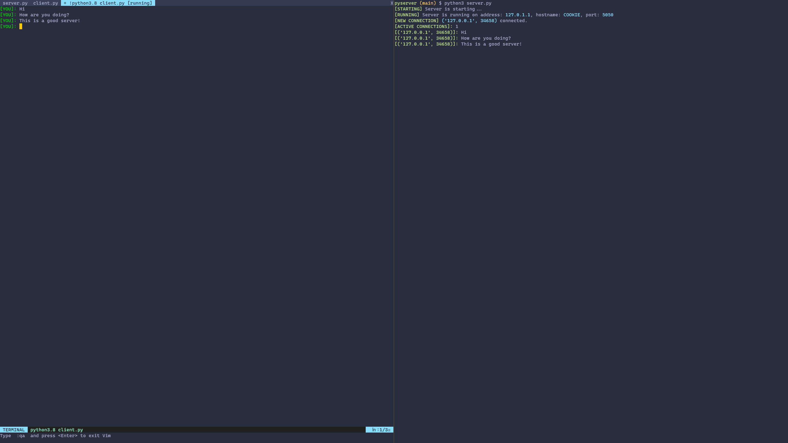

# Pyserver
> A simple Python3 socket server that you can use in your projects.

Please note that this is more of a starting point rather than a full featured socket server.

**This is meant to be customized to your needs in your project!**

You can use it in any way! 😎

## Screenshots

